# LearningJuiceAutoScout: Complete System Architecture

## System Overview

AutoScout is a computer vision pipeline that automatically tracks four robots in FTC (FIRST Tech Challenge) match videos, detects shots, and exports structured data for analysis.

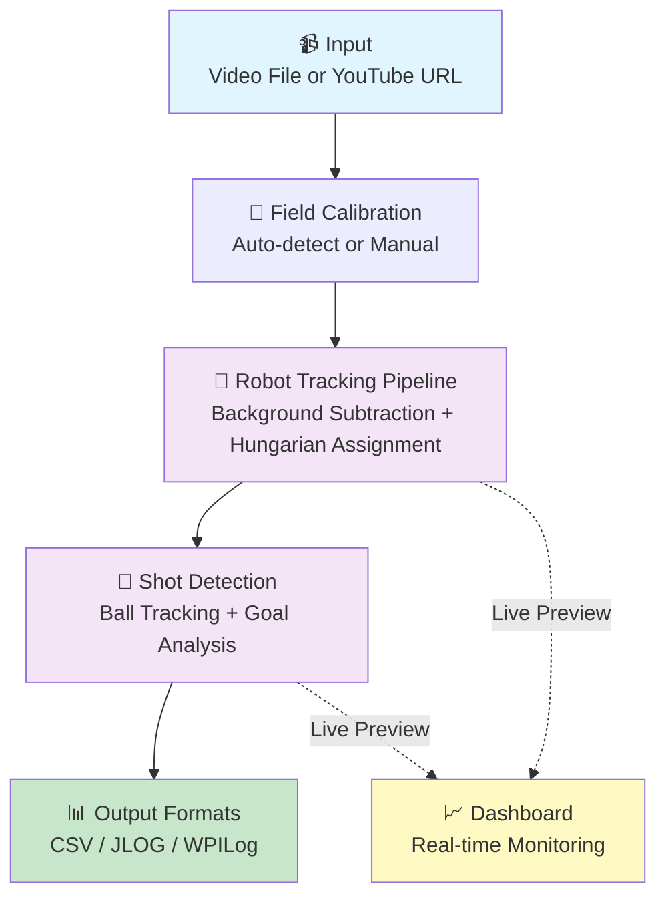

---

## Module Organization

### Core Tracking Package (`autoscout/`)

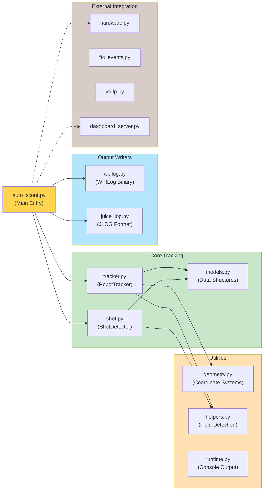

### Data Flow Through Pipeline

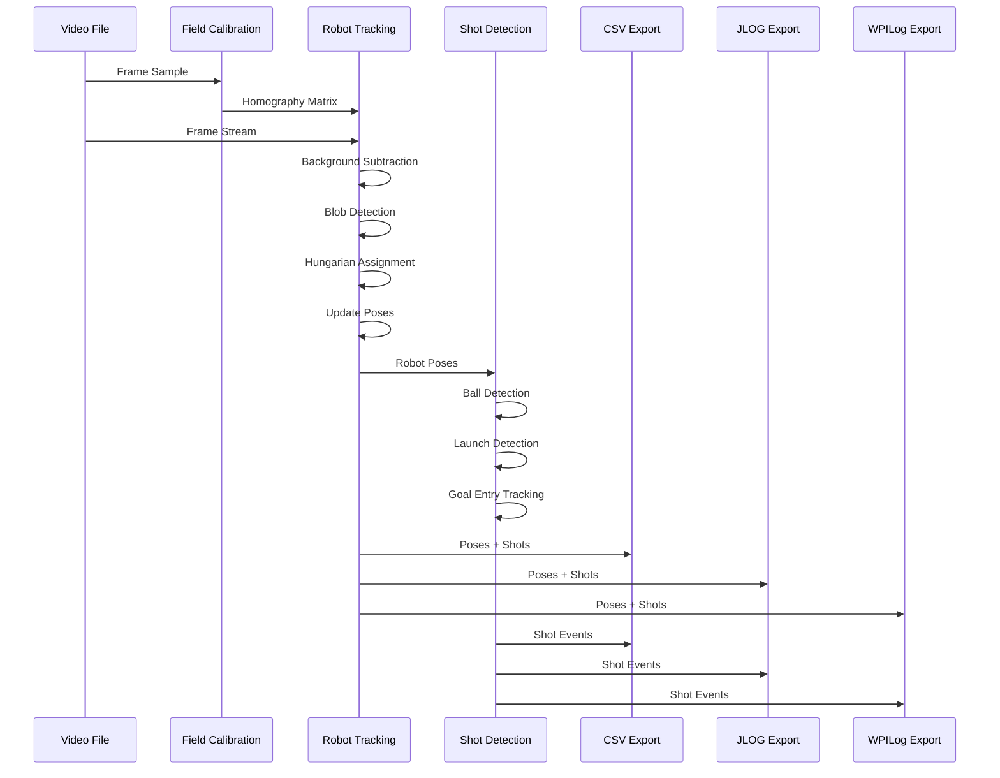

---

## Coordinate System Transformations

The system uses three coordinate frames with transformations between them:

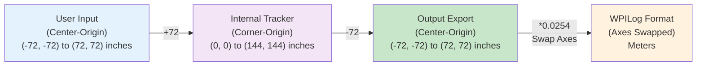

**Transformation Functions:**
- `_field_center_to_corner_xy(x, y)`: User input → Tracker (add 72)
- `_field_corner_to_center_xy(x, y)`: Tracker → Output (subtract 72)
- `_normalize_angle_rad(angle)`: Heading to (-π, π] range

---

## Robot Tracking Algorithm

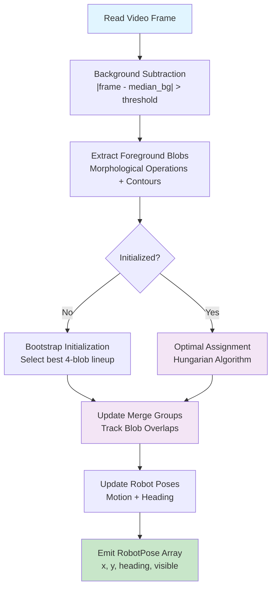

**Key Parameters:**
- `FG_THRESH = 30`: Foreground difference threshold
- `BLOB_MIN = 350`: Minimum blob area (pixels²)
- `MAX_COAST = 60`: Frames track survives without detection
- `REID_COST_WEIGHT = 1.60`: Appearance cost weight

### Hungarian Assignment Cost Matrix

```
Rows: 4 robot tracks
Cols: N detected blobs + 4 skip options

Cost Components:
├─ Motion prediction error (field space)
├─ Motion prediction error (image space)
├─ Blob quality penalty
├─ Appearance distance (re-ID histogram)
├─ Post-merge lock penalties
└─ Coast/reacquisition penalties
```

---

## Merge Group Management (3+ Robot Collisions)

When multiple robots share a foreground blob (collision):

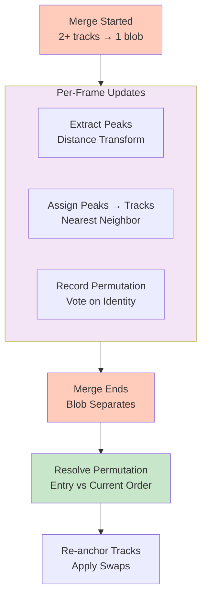

**Data Structures:**
- `entry_order`: Track IDs at merge start (immutable)
- `current_order`: Track IDs in current frame (updated per frame)
- `peak_assignment`: Pixel positions of each track within blob
- `order_votes`: Voting matrix for permutation resolution

---

## Shot Detection Pipeline

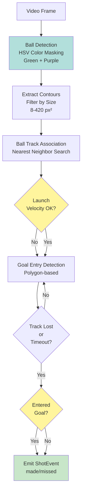

**Shot Launch Criteria:**
- Minimum displacement: 8 pixels
- Minimum speed: 2 px/frame
- Minimum upward motion: 3 pixels (y decreases)
- Positive acceleration: ≥35% (speed increasing)
- Life: ≥2 frames

---

## Output Formats

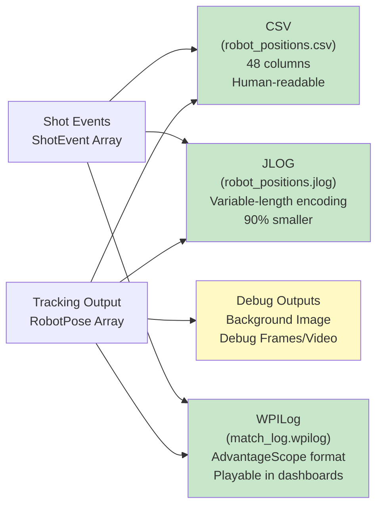

### CSV Structure (48 Columns)

```
timestamp_s,
robot0_x_in, robot0_y_in, robot0_heading_rad, robot0_visible,
robot1_x_in, robot1_y_in, robot1_heading_rad, robot1_visible,
robot2_x_in, robot2_y_in, robot2_heading_rad, robot2_visible,
robot3_x_in, robot3_y_in, robot3_heading_rad, robot3_visible,
robot0_shot_result, robot0_shot_x_in, robot0_shot_y_in, robot0_shot_goal,
... (repeated for robots 1-3)
```

**Coordinates:** Center-origin system (0,0 = field center)

---

## Entry Points and CLI

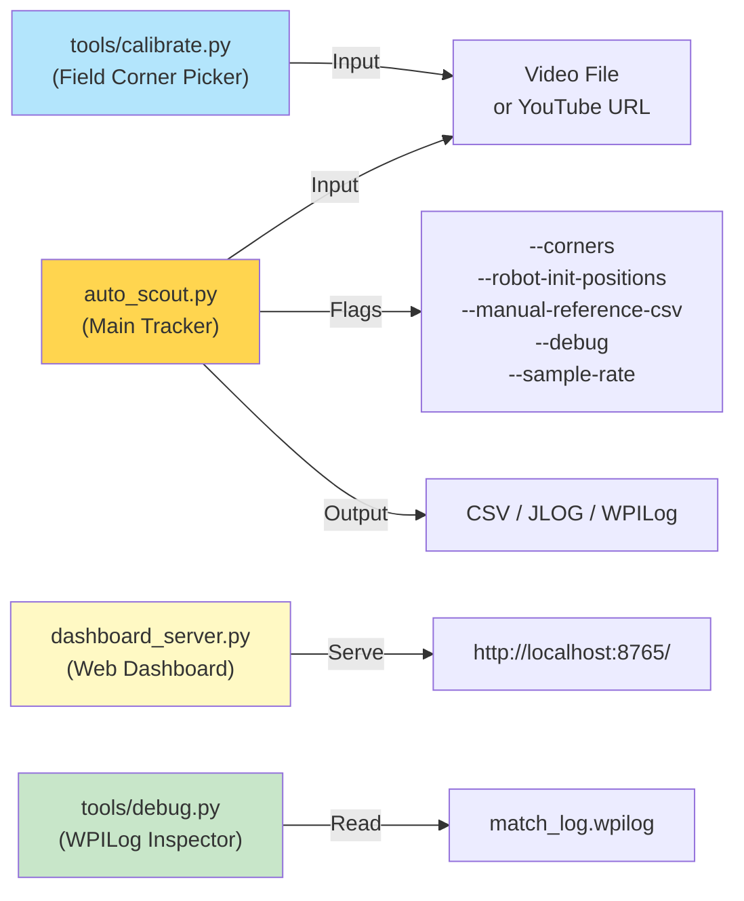

---

## Performance Characteristics

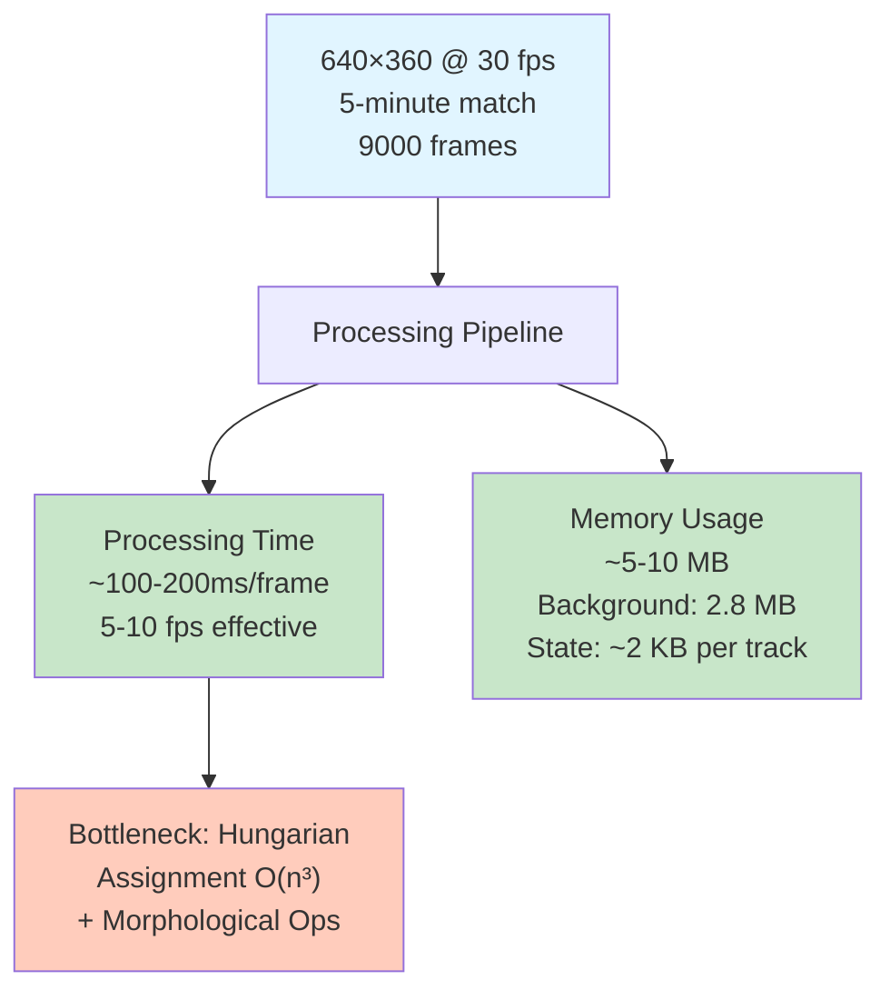

---

## Error Handling & Recovery

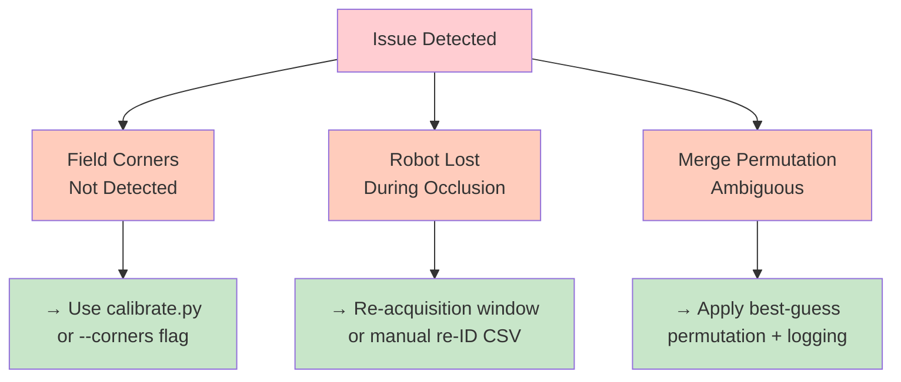

---

## Integration with FIRST Ecosystem

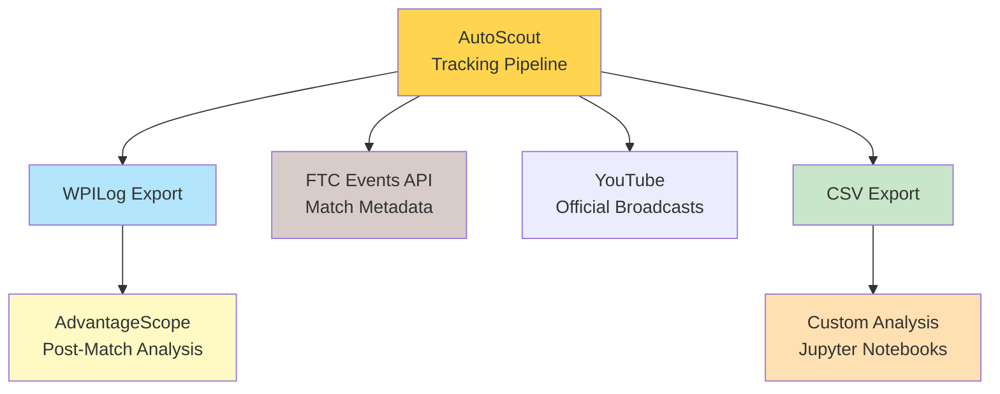

---

## Key Design Patterns

### 1. State Machine (Tracker Lifecycle)

```
[Uninitialized]
    ↓ (detect 4 valid blobs)
[Initialized]
    ↓ (loop until video ends)
    ├─ Extract blobs
    ├─ Assign to tracks (Hungarian)
    ├─ Manage merges
    ├─ Emit poses
    └─ (repeat)
```

### 2. Cost-Matrix Assignment

Minimize total cost subject to: each track ≤ 1 blob, each blob ≤ 1 track

**Cost = Distance + Quality + Appearance + Penalties**

### 3. Homography-Based Perspective Transform

```
Image Space (pixels)  ←→  Field Space (inches)
    via OpenCV.findHomography(corners, dst2d)
```

### 4. Merge Group Voting

For 3+ robot merges, use voting to resolve permutations:
```
entry_order[0]  →  robot at position 0 at merge start
current_order[0] → robot at position 0 in current frame
Permutation = mapping entry → current
```

---

## Quick Reference: Common Workflows

### Track Local Video with Known Corners

```bash
python3 auto_scout.py \
  --no-download \
  --video-path match.mp4 \
  --corners field_corners.json
```

### Calibrate Field Corners

```bash
python3 tools/calibrate.py match.mp4 --output field_corners.json --frame 100
```

### Enable Debug Output

```bash
python3 auto_scout.py ... --debug --debug-video --debug-every 5
```

### Bootstrap Re-ID Model

```bash
# 1. Create manual_poses.csv with hand-labeled positions
# 2. Run tracker with:
python3 auto_scout.py ... --manual-reference-csv manual_poses.csv
```

### Start Web Dashboard

```bash
python3 dashboard_server.py --host 127.0.0.1 --port 8765
# Open http://127.0.0.1:8765/ in browser
```

---

## Testing & Validation

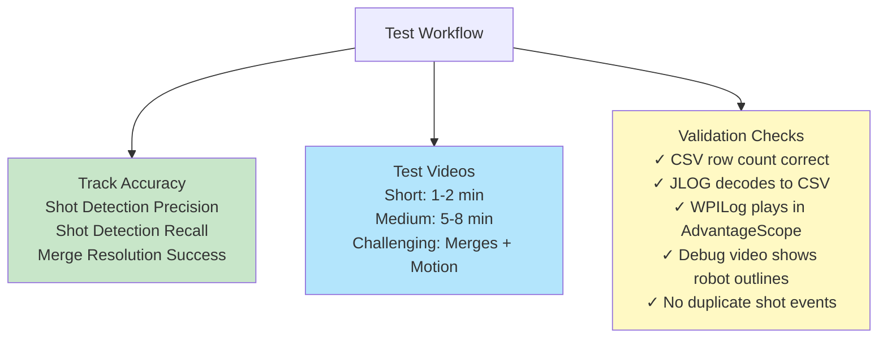

---

## Architecture Summary

**Strengths:**
- Robust tracking via Hungarian assignment + re-ID
- Handles complex merge scenarios with voting system
- Multiple output formats for different use cases
- Real-time dashboard for monitoring

**Components:**
- 11 core tracking modules
- 4+ utility modules
- 3 export formats (CSV, JLOG, WPILog)
- Web dashboard + CLI tools

**Performance:**
- 10 fps on modern 4-core CPU (640×360 video)
- ~5-10 MB memory footprint
- 90% file size reduction with JLOG format

**Integration:**
- AdvantageScope playback via WPILog
- FTC Events discovery
- YouTube integration via yt-dlp
- Custom analysis via CSV export
